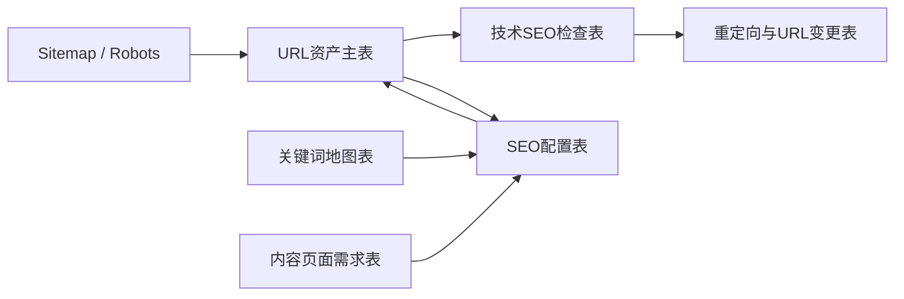
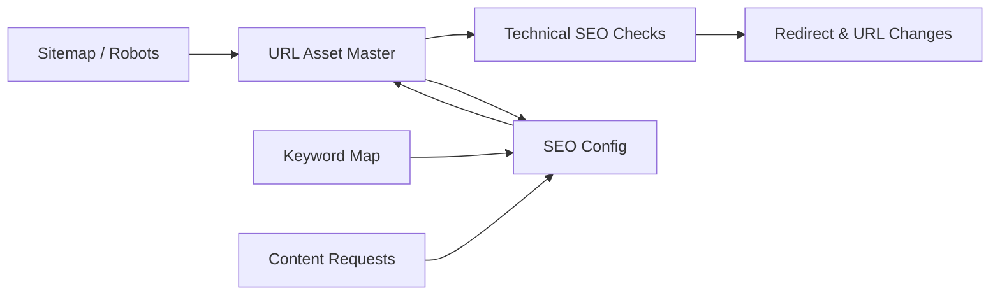

<div align="center">

# SEO URL Architecture

**Feishu/Lark based SEO URL management system for URL inventory, technical SEO checks, redirects, and publishing metadata.**

**基于飞书/Lark 多维表格的 SEO URL 管理系统：统一管理 URL 资产、技术 SEO 检查、重定向和发布配置。**

[中文](#中文) · [English](#english)

</div>

---

## 中文

### 项目简介

`SEO URL Architecture` 是一个面向 SEO、内容团队和技术团队的公开模板。它把网站 URL 资产、sitemap、canonical、robots、SEO metadata、重定向、关键词映射和页面需求集中到 Feishu/Lark 多维表格中，并通过脚本自动同步和检查。

它适合这些场景：

- 网站页面很多，URL 管理分散在表格、文档、CMS 和代码里。
- SEO 配置、技术排查、重定向和内容需求缺少统一台账。
- Sitemap、canonical、robots、title、description 等技术 SEO 信号需要定期检查。
- SEO 和技术团队需要基于同一张 URL 资产表协作。

> 本项目是公开模板。真实的 Feishu/Lark token、Base ID、用户 ID、日志、内部 URL 和公司策略应只保存在本地 `.env` 或私有系统里，不要提交到 GitHub。

[安装](#安装) · [表格结构](#表格结构) · [运行流程](#运行流程) · [团队-SOP](#团队-sop) · [隐私安全](#隐私安全)

---

### 系统如何工作



核心思路是先建立一个 URL 资产主表，再围绕它做检查、配置和变更：

1. 从 sitemap 自动同步现有 URL。
2. 把每个正式页面沉淀为一条 URL 资产。
3. 定期抓取页面状态、title、meta description、H1、canonical、robots 和 sitemap 收录情况。
4. 把高风险问题写入技术 SEO 检查表，方便技术团队优先处理。
5. 把 SEO title、meta description、关键词和发布配置放入 SEO 配置表。
6. 对 URL 改版、路径替换和 canonical mismatch 建立重定向与 URL 变更记录。

### 表格结构

默认模板包含 7 张表：

| 表名 | 用途 | 典型负责人 |
| --- | --- | --- |
| `URL资产主表` | 网站所有可管理页面的唯一资产台账 | SEO / 技术 |
| `技术SEO检查表` | 定期记录页面级技术 SEO 检查结果 | 技术 |
| `SEO配置表` | 管理 SEO URL、title、meta description、关键词和配置状态 | SEO |
| `重定向与URL变更表` | 跟踪旧 URL、新 URL、canonical 和 redirect 处理状态 | SEO / 技术 |
| `配置字典` | 保存域名、sitemap、robots、标题长度规则等全局配置 | SEO |
| `关键词地图表` | 管理页面与目标关键词、搜索意图、优先级的映射 | SEO |
| `内容页面需求表` | 收集新页面、内容更新、落地页需求 | SEO / 内容 |

更完整的字段说明见：

- [飞书多维表格结构方案](docs/bitable-schema.md)
- [SEO URL 管理系统使用说明](docs/seo-url-management-user-guide.md)
- [表头模板](templates/table-headers.md)

### 安装

环境要求：

- Node.js 20.6+
- Feishu/Lark workspace 权限
- Feishu/Lark 多维表格 app token
- `@larksuite/cli`

脚本会通过 `npx -y @larksuite/cli` 调用 CLI，不需要全局安装。

克隆仓库：

```bash
git clone <your-repo-url>
cd seo-url-architecture
```

创建环境变量文件：

```bash
cp .env.example .env
```

填写 `.env`：

```bash
SEO_URL_BASE_TOKEN=your_bitable_app_token
SEO_SITEMAP_URL=https://example.com/sitemap.xml
SEO_ROBOTS_URL=https://example.com/robots.txt
SEO_CANONICAL_DOMAIN=example.com
SEO_WWW_DOMAIN=www.example.com
SEO_TECH_CHECK_LIMIT=120
SEO_REDIRECT_CHECK_LIMIT=120
```

登录 Feishu/Lark：

```bash
npx -y @larksuite/cli auth login
```

初始化多维表格结构：

```bash
npm run init:base
```

初始化后会生成 `base-state.json`，里面存放生成后的表 ID。不要提交这个文件。

### 运行流程

同步 sitemap URL 到 `URL资产主表`：

```bash
npm run sync:sitemap
```

运行技术 SEO 检查：

```bash
npm run check:technical
```

基于 canonical mismatch 生成重定向候选记录：

```bash
npm run setup:redirects
```

校验重定向记录：

```bash
npm run check:redirects
```

### 自动化建议

可以把 `scripts/*.sh` 接入 cron、launchd、GitHub Actions、云函数或其他定时任务。

推荐节奏：

| 任务 | 建议频率 | 说明 |
| --- | --- | --- |
| Sitemap 同步 | 每天 1-2 次 | 捕捉新增页面、下线页面和 sitemap 变化 |
| 技术 SEO 检查 | 每天 1-2 次 | 检查状态码、索引信号、canonical 和 metadata |
| 重定向校验 | 技术检查后运行 | 验证旧 URL 是否跳转到正确目标 |
| SEO 配置复核 | 发布前或每日 | 确认 title、description、keyword、status |

生产环境建议使用服务器、GitHub Actions 或云端定时任务，不建议长期依赖个人电脑。

### 团队 SOP

安全状态：

- `Live`：页面正常在线。
- `Indexable = Yes`：页面允许索引。
- `Sitemap Included = Yes`：页面已出现在 sitemap 中。
- `Issue Level = Low`：只有轻微优化项，不影响基本收录。
- `Redirect Status = Passed`：重定向或 canonical 校验通过。

需要优先排查：

- `Issue Level = High`：高风险技术 SEO 问题，例如 4xx/5xx、canonical 异常、robots 阻挡、重要页面不在 sitemap。
- `Indexable = No`：页面可能不能被搜索引擎索引。
- `Sitemap Included = Missing`：重要页面没有进入 sitemap。
- `Status = Needs Update`：页面资产信息不完整或需要重新确认。
- `Redirect Status = Failed`：旧 URL 跳转目标错误、没有跳转或跳转链异常。

建议协作方式：

- SEO 负责人维护页面优先级、关键词、SEO 配置和内容需求。
- 技术负责人处理 high issue、sitemap、canonical、robots、redirect 和页面状态问题。
- 内容负责人根据 `内容页面需求表` 和 `SEO配置表` 补充页面内容和 metadata。

### 隐私安全

不要提交：

- `.env`
- `base-state.json`
- Feishu/Lark app token
- 用户 open ID
- 二维码
- 日志
- 下载的表格文件
- 私有项目的生产 URL
- 内部页面优先级、关键词策略和技术缺陷记录

公开仓库建议使用 `example.com`、占位 token 和通用页面示例。公开文档可以带来项目展示和技术可信度，但不要把它当作核心外链策略；真正有价值的 SEO 外链通常来自相关内容、产品页面、媒体报道、社区引用和高质量文档。

### 注意事项

Feishu/Lark 原生工作流不完全可移植，因为每个 Base 的字段 ID 都不同。这个仓库适合创建表结构和运行外部自动检查；通知类工作流建议在自己的 workspace 中配置，或基于本地字段 ID 扩展脚本生成。

[Back to top](#seo-url-architecture)

---

## English

### Overview

`SEO URL Architecture` is a public template for SEO, content, and engineering teams. It centralizes URL inventory, sitemap data, canonical signals, robots rules, SEO metadata, redirects, keyword mapping, and page requests in Feishu/Lark Bitable, then uses scripts to sync and inspect them automatically.

It is useful when:

- A website has many pages and URL ownership is scattered across spreadsheets, docs, CMS, and code.
- SEO configuration, technical issues, redirects, and content requests do not share one source of truth.
- Technical SEO signals such as sitemap, canonical, robots, title, description, and H1 need regular checks.
- SEO and engineering teams need to collaborate from the same URL asset table.

> This is a public template. Real Feishu/Lark tokens, Base IDs, user IDs, logs, internal URLs, and company strategy should stay in local `.env` files or private systems. Do not commit them to GitHub.

[Install](#install) · [Table Schema](#table-schema) · [Workflow](#workflow) · [Team SOP](#team-sop) · [Privacy](#privacy)

---

### How It Works



The system starts with one central URL asset table, then connects checks, metadata, and change tracking around it:

1. Sync existing URLs from the sitemap.
2. Store each production page as one URL asset record.
3. Regularly fetch HTTP status, title, meta description, H1, canonical, robots, and sitemap inclusion.
4. Write high-risk findings into the technical SEO check table for engineering follow-up.
5. Manage SEO title, meta description, keywords, and publishing status in the SEO config table.
6. Track URL migrations, path changes, canonical mismatches, and redirect validation.

### Table Schema

The default template contains 7 tables:

| Table | Purpose | Typical Owner |
| --- | --- | --- |
| `URL资产主表` | Central source of truth for all manageable website pages | SEO / Engineering |
| `技术SEO检查表` | Page-level technical SEO check history | Engineering |
| `SEO配置表` | SEO URL, title, meta description, keywords, and configuration status | SEO |
| `重定向与URL变更表` | Old URL, new URL, canonical, and redirect tracking | SEO / Engineering |
| `配置字典` | Global settings such as domain, sitemap, robots, and title length rules | SEO |
| `关键词地图表` | Page-to-keyword, intent, and priority mapping | SEO |
| `内容页面需求表` | New page, landing page, and content update requests | SEO / Content |

Detailed docs:

- [Bitable schema](docs/bitable-schema.md)
- [User guide](docs/seo-url-management-user-guide.md)
- [Table headers](templates/table-headers.md)

### Install

Requirements:

- Node.js 20.6+
- Feishu/Lark workspace access
- A Feishu/Lark Bitable app token
- `@larksuite/cli`

The scripts call the CLI through `npx -y @larksuite/cli`, so you do not need to install it globally.

Clone the repository:

```bash
git clone <your-repo-url>
cd seo-url-architecture
```

Create the environment file:

```bash
cp .env.example .env
```

Fill in `.env`:

```bash
SEO_URL_BASE_TOKEN=your_bitable_app_token
SEO_SITEMAP_URL=https://example.com/sitemap.xml
SEO_ROBOTS_URL=https://example.com/robots.txt
SEO_CANONICAL_DOMAIN=example.com
SEO_WWW_DOMAIN=www.example.com
SEO_TECH_CHECK_LIMIT=120
SEO_REDIRECT_CHECK_LIMIT=120
```

Authenticate with Feishu/Lark:

```bash
npx -y @larksuite/cli auth login
```

Initialize the Bitable schema:

```bash
npm run init:base
```

This writes `base-state.json`, which stores generated table IDs. Do not commit `base-state.json`.

### Workflow

Sync sitemap URLs into the URL asset table:

```bash
npm run sync:sitemap
```

Run technical SEO checks:

```bash
npm run check:technical
```

Create redirect candidate records from canonical mismatches:

```bash
npm run setup:redirects
```

Validate redirect records:

```bash
npm run check:redirects
```

### Automation

The shell wrappers in `scripts/*.sh` can be used with cron, launchd, GitHub Actions, cloud functions, or any scheduler.

Recommended cadence:

| Task | Cadence | Notes |
| --- | --- | --- |
| Sitemap sync | 1-2 times per day | Detect new pages, removed pages, and sitemap changes |
| Technical SEO checks | 1-2 times per day | Check status, indexability, canonical, and metadata |
| Redirect validation | After technical checks | Validate old URL targets and redirect chains |
| SEO config review | Before publishing or daily | Confirm title, description, keyword, and status |

For production use, prefer a server, GitHub Actions, or a cloud scheduler over a personal laptop.

### Team SOP

Safe states:

- `Live`: the page is online.
- `Indexable = Yes`: the page is allowed to be indexed.
- `Sitemap Included = Yes`: the page exists in the sitemap.
- `Issue Level = Low`: only minor optimization items were found.
- `Redirect Status = Passed`: redirect or canonical validation passed.

Prioritize investigation when:

- `Issue Level = High`: high-risk technical SEO issue, such as 4xx/5xx, canonical mismatch, robots blocking, or important page missing from sitemap.
- `Indexable = No`: the page may not be indexable.
- `Sitemap Included = Missing`: an important page is missing from the sitemap.
- `Status = Needs Update`: the URL asset record is incomplete or needs review.
- `Redirect Status = Failed`: old URL target is wrong, missing, or has an unexpected redirect chain.

Suggested ownership:

- SEO owners maintain page priority, keywords, SEO config, and content requests.
- Engineering owners handle high-risk issues, sitemap, canonical, robots, redirects, and page status.
- Content owners update page copy and metadata based on content requests and SEO config.

### Privacy

Never commit:

- `.env`
- `base-state.json`
- Feishu/Lark app tokens
- user open IDs
- QR codes
- logs
- downloaded spreadsheets
- private production URLs
- internal page priorities, keyword strategy, or technical issue records

For public repositories, use `example.com`, placeholder tokens, and generic page examples. Public documentation can help with project visibility and technical credibility, but it should not be treated as a core backlink strategy. Strong SEO backlinks usually come from relevant content, product pages, media coverage, community references, and high-quality documentation.

### Notes

Feishu/Lark native workflow automation rules are not fully portable because field IDs differ between Bases. Use this repository to create the table structure and run external checks; configure native Feishu/Lark notifications inside your own workspace or extend the scripts to generate workflows from your local field IDs.

[Back to top](#seo-url-architecture)
